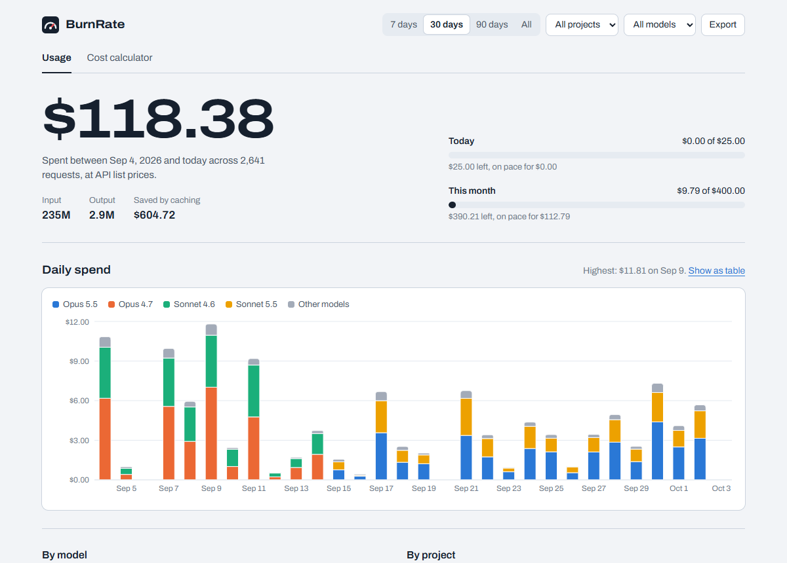
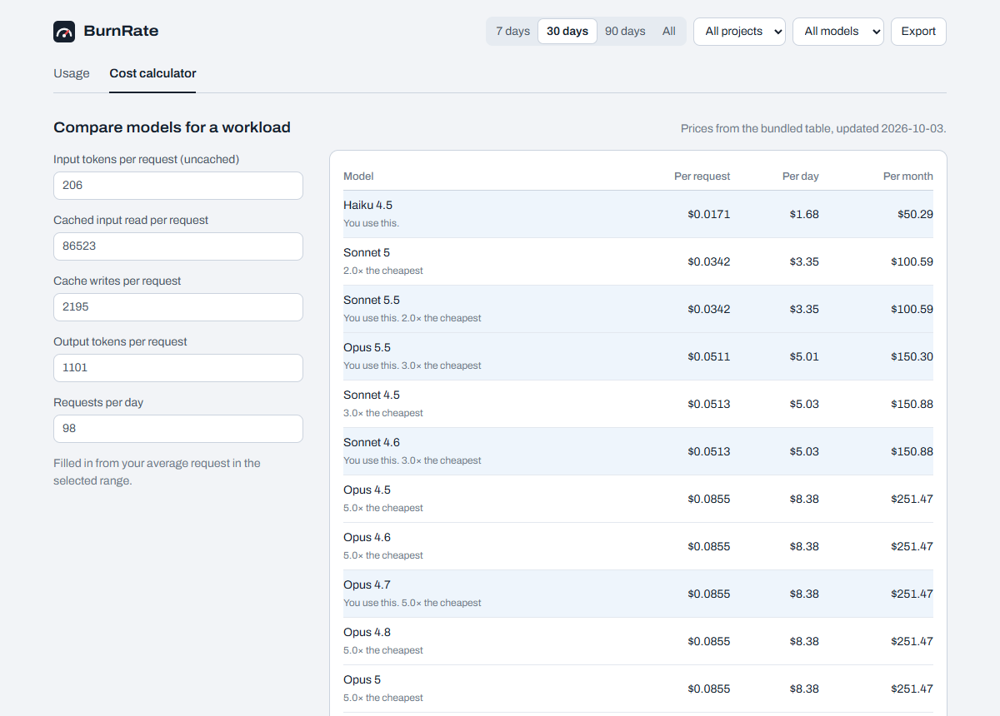

# BurnRate

**See how much of your Claude usage limit is left, and what your usage costs.**

BurnRate adds a live meter to Claude Code, a status bar item to VS Code, and a local dashboard. Everything stays on your computer.

```
Opus 5.5 │ 5h ▰▰▰▰▰▰▱▱ 72% ↻ 1h12m ⚠ limit in 48m │ 7d 41% ↻ 3d4h │ ctx 31% │ $1.23 session │ $12.80 today
```



<sub>Screenshot with demo data.</sub>

<br>

## What you get

- **A live meter in Claude Code:** your 5-hour and weekly limits, when they reset, and a warning before you run out.
- **A meter in VS Code:** right under the Claude Code chat, and in the status bar.
- **A dashboard:** spend per day, model, and project; budgets; and a calculator that compares models.
- **Cost reports** in your terminal, with CSV and JSON export.

No account, no sign-up, and no data leaves your machine.

<br>

## Install

You need [Node.js 22.13 or newer](https://nodejs.org) and [Claude Code](https://code.claude.com).

**1. Install BurnRate**

```sh
npm install -g https://github.com/Stellin-15/burnrate/releases/latest/download/burnrate-cli.tgz
```

**2. Turn on the meter**

```sh
burnrate init claude-code
```

**3. Send any message in Claude Code.** The meter appears at the bottom.

That's it. Run `burnrate doctor` if anything looks off.

<br>

### Optional: the VS Code extension

If you use Claude Code inside VS Code:

1. Download [`burnrate-vscode.vsix`](https://github.com/Stellin-15/burnrate/releases/latest/download/burnrate-vscode.vsix).
2. In VS Code, open **Extensions**, click **⋯** → **Install from VSIX…**, and pick the file.
   Or, in a terminal: `code --install-extension burnrate-vscode.vsix`
3. Run `claude` in a terminal once and send a message. This gives BurnRate its first reading of your limits.

<br>

## Using BurnRate

### The meter in Claude Code

| Part             | Meaning                                                                       |
| ---------------- | ----------------------------------------------------------------------------- |
| `5h 72% ↻ 1h12m` | You've used 72% of your 5-hour session limit. It resets in 1 hour 12 minutes. |
| `7d 41% ↻ 3d4h`  | You've used 41% of your weekly limit. It resets in 3 days 4 hours.            |
| `⚠ limit in 48m` | At your current pace, you'll hit the limit before it resets.                  |
| `ctx 31%`        | How full the conversation's context window is.                                |
| `$1.23 session`  | What this session would cost at API prices.                                   |
| `$12.80 today`   | The same, for everything you've done today.                                   |

Colors go from green to yellow (60%) to red (85%).

Try other looks without changing anything:

```sh
burnrate statusline --demo
burnrate statusline --demo --theme minimal
burnrate statusline --demo --theme plain
```

<br>

### In VS Code

The extension adds a **BurnRate** section under the Claude Code chat, and the same meter to the status bar:

```
5h 41% ↻ 1h48m │ 7d 38% ↻ 3d11h │ $47.10 today
```

Hover over it for details. Click it to open the dashboard.

> **Why it needs one terminal session:** Claude Code's chat panel doesn't report your limits, only Claude Code in a terminal does. After one reading, BurnRate keeps the numbers up to date from your chat-panel usage (shown with `~`). Running `claude` in a terminal again refreshes them exactly.

<br>

### The dashboard

```sh
burnrate dashboard
```

This opens a page in your browser, served from your own computer. It has:

- **Usage:** spend per day, model, project, and session, plus budgets and your plan limits
- **Cost calculator:** what a workload costs on every model, and what your real history would have cost on a different model
- **API spend:** what your API organization was billed (see below)
- **Export:** CSV and JSON

Press **Ctrl+C** in the terminal to stop it.



<br>

### Reports in the terminal

```sh
burnrate report                 # daily, last 30 days
burnrate report models          # which models cost the most
burnrate report sessions        # your most expensive sessions
burnrate report blocks          # 5-hour usage windows
```

Add `--since 7d`, `--project <name>`, `--model <name>`, `--limit 10`, or `--csv` / `--json`.

<br>

### Budgets

Add this to `~/.burnrate/config.json` (create it with `burnrate config init`):

```json
{ "budgets": { "daily": 25, "monthly": 400 } }
```

The dashboard shows a meter for each one. It turns amber when you're on pace to go over, and red when you have.

<br>

### API spend (for API organizations)

If your team pays for the Anthropic or OpenAI API through an organization, BurnRate can show what you were actually billed:

```sh
burnrate keys add anthropic     # paste an Admin key; loads the last 30 days
burnrate spend                  # billed vs. list price, per day
```

<details>
<summary>More about API spend</summary>

<br>

- You need an **organization Admin key**: `sk-ant-admin01-…` from the [Claude Console](https://platform.claude.com/settings/admin-keys), or `sk-admin-…` from [OpenAI](https://platform.openai.com/settings/organization/admin-keys). Regular API keys can't read usage.
- Keys are stored in your **OS keychain**, never in a file. You can also set `ANTHROPIC_ADMIN_KEY` or `OPENAI_ADMIN_KEY` instead.
- Other commands: `burnrate keys list`, `burnrate keys remove anthropic`, `burnrate sync`, and `burnrate spend --by model`.
- The dashboard refreshes spend every 15 minutes while it's open.

</details>

<br>

## How accurate is it?

- **Limits (Pro and Max plans):** exact. They come straight from Claude Code. In VS Code's chat panel they're kept up to date by estimate and marked `~`.
- **Reset times:** exact when Claude Code reports them. Otherwise BurnRate estimates from your activity and marks them `~`. Anthropic counts usage across all Claude apps (web, desktop, and mobile), and BurnRate only sees Claude Code on this computer.
- **Dollar amounts:** what the same tokens would cost at API list prices. On a Pro or Max plan you aren't billed per token, so read them as "what this usage is worth."

<br>

## Privacy

- **Nothing leaves your computer**, unless you add an API key. Then BurnRate only contacts that provider, and only when you sync.
- BurnRate reads Claude Code's local logs, but **only token counts, models, and times**. It never reads or stores your messages.
- Its own files live in `~/.burnrate/`. Delete that folder at any time.
- `burnrate init` changes one setting in Claude Code (`statusLine`) and saves a backup first.

<br>

## Troubleshooting

**The meter doesn't show up.**
Run `burnrate doctor`, then send a message in Claude Code. The meter updates after each reply.

**The 5h and 7d numbers are missing.**
They appear for Claude Pro and Max plans, after Claude Code's first reply in a session. With an API key there's no plan limit, so BurnRate shows your spend instead.

**VS Code shows only today's cost.**
Run `claude` in a terminal once and send a message, so BurnRate gets its first reading.

**A model shows $0.00.**
It isn't in the pricing table yet. `burnrate doctor` lists it. Please [open an issue](https://github.com/Stellin-15/burnrate/issues).

**The colors look wrong.**
Use the plain theme (`burnrate config init`, then set `"theme": "plain"`), or set `NO_COLOR=1`.

<br>

## Uninstall

```sh
burnrate uninstall claude-code     # restores your previous status line
npm uninstall -g burnrate-cli
```

In VS Code, uninstall **BurnRate** from the Extensions view. Delete `~/.burnrate` to remove all data.

<br>

## All commands

| Command                                  | What it does                                 |
| ---------------------------------------- | -------------------------------------------- |
| `burnrate init claude-code`              | Turn on the meter (`--dry-run` to preview)   |
| `burnrate uninstall claude-code`         | Turn it off and restore your old status line |
| `burnrate dashboard`                     | Open the dashboard                           |
| `burnrate report [view]`                 | Usage and cost tables                        |
| `burnrate doctor`                        | Check your setup                             |
| `burnrate config [show\|init\|validate]` | Manage settings                              |
| `burnrate keys add\|list\|remove`        | Manage API Admin keys                        |
| `burnrate sync` / `burnrate spend`       | Load and compare API billing                 |
| `burnrate statusline --demo`             | Preview the meter                            |

Every setting is explained in [docs/configuration.md](docs/configuration.md).

<br>

## Build from source

```sh
git clone https://github.com/Stellin-15/burnrate.git
cd burnrate
corepack enable
pnpm install
pnpm build
node packages/cli/dist/cli.js init claude-code
```

Contributions are welcome. Start with [CONTRIBUTING.md](CONTRIBUTING.md). Pricing updates and support for more tools are the most useful.

<br>

## Roadmap

**Done:** Claude Code meter, VS Code extension, dashboard, reports, budgets, usage history, and API spend for Anthropic and OpenAI.

**Next:** support for Codex CLI, Gemini CLI, OpenCode, and Aider; a desktop overlay; publishing to npm and the VS Code Marketplace.

Details are in [docs/project-plan.md](docs/project-plan.md).

<br>

## License

[MIT](LICENSE)
